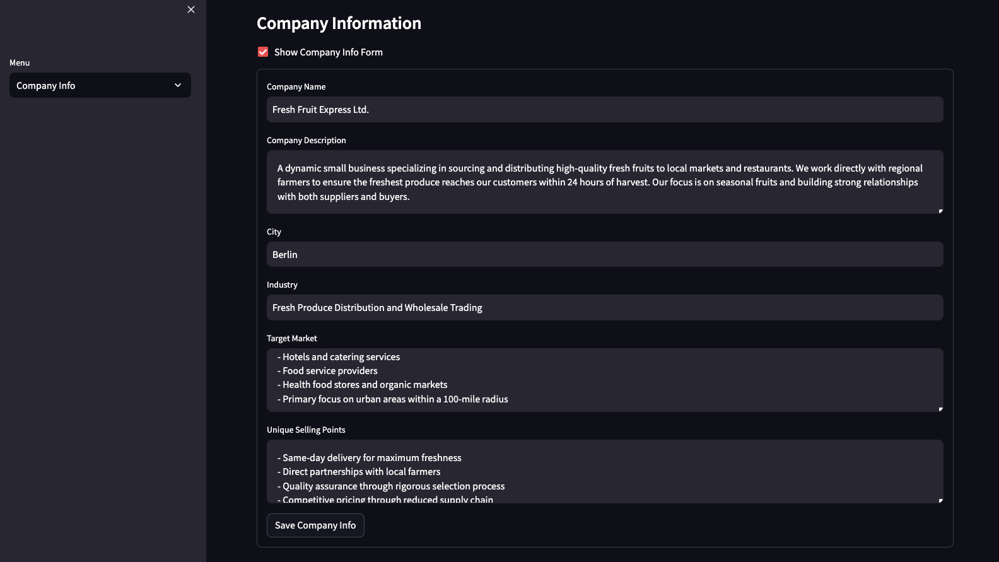
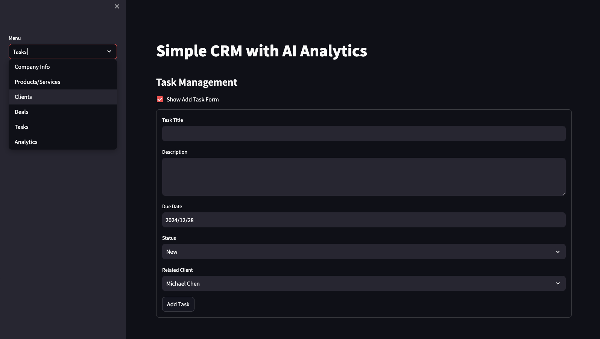
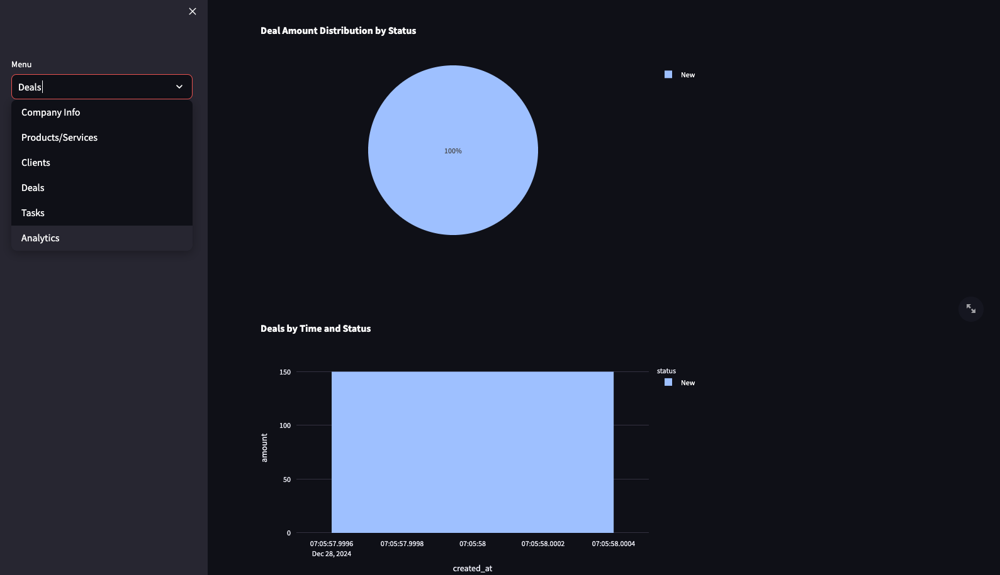

# Simple CRM with AI


[](https://opensource.org/licenses/MIT)
[](https://streamlit.io)
[](https://github.com/psf/black)
[](https://github.com/KazKozDev/Simple-CRM-with-AI/graphs/commit-activity)

A simple yet powerful CRM (Customer Relationship Management) system built with Python, Streamlit, and AI analytics capabilities. The system uses Ollama's Gemma2 model for generating insights about clients and deals.


## Features

- 🏢 Company Information Management
- 🛍️ Products/Services Management
- 👥 Client Management with AI-powered analysis
- 💰 Deal Tracking with AI-powered success prediction
- ✅ Task Management
- 📊 Advanced Analytics Dashboard
- 🤖 Local AI processing using Ollama
- 🔒 Secure local database storage

## Screenshots

### Company Information Management

Manage your company details, target market, and unique selling points in one place.

### Task Management

Create, assign, and track tasks with due dates and client associations.

### Deal Analytics

Monitor your deal pipeline and track performance with interactive visualizations.

## Installation

1. Clone this repository:
```bash
git clone https://github.com/KazKozDev/Simple-CRM-with-AI.git
cd Simple-CRM-with-AI
```

2. Install required Python packages:
```bash
pip install -r requirements.txt
```

3. Install Ollama:
   - **macOS**: Visit https://ollama.ai and download the installer
   - **Windows**: 
     - Install WSL2 following [Microsoft's guide](https://learn.microsoft.com/en-us/windows/wsl/install)
     - Install Ollama in WSL2 following [Ollama's guide](https://github.com/ollama/ollama/blob/main/docs/windows.md)

4. Pull the Gemma2 model:
```bash
# macOS
ollama pull gemma2:9b

# Windows (in WSL2)
wsl -d Ubuntu -e ollama pull gemma2:9b
```

## Manual Startup

### macOS

1. Start Ollama if not running:
```bash
open -a Ollama
```

2. Start the CRM:
```bash
streamlit run crm.py
```

### Windows (WSL2)

1. Start Ubuntu (WSL):
```powershell
wsl -d Ubuntu
```

2. In WSL terminal:
```bash
# Start Ollama service
sudo systemctl start ollama

# Start the CRM
streamlit run crm.py
```

The application will be available at http://localhost:8501 in your web browser.

## Quick Start for macOS

The easiest way to run the application on macOS:

1. Install Ollama from https://ollama.ai

2. Make the startup script executable. You can do this in two ways:

**Using Terminal:**
```bash
chmod +x start_crm.command
```

**Using Finder:**
- Find start_crm.command in Finder
- Right-click (or Control + click) on the file
- Select "Get Info"
- In "Sharing & Permissions" section, check "Execute" for your user

Note: This step is only needed once after creating the file.

3. Run the application:
- Double-click `start_crm.command` in Finder
- Or run it from Terminal: `./start_crm.command`

The script will:
- Check if Ollama is installed
- Start Ollama if it's not running
- Download the Gemma2 model if needed
- Launch the CRM application

The CRM interface will automatically open in your default web browser at http://localhost:8501

## Requirements

- Python 3.8+
- Ollama installed locally (https://ollama.ai)
- Gemma2:9b model for Ollama
- Required Python packages (see requirements.txt)

## Project Structure

```
Simple-CRM-with-AI/
│
├── crm.py              # Main application file
├── start_crm.command   # Startup script for macOS
├── requirements.txt    # Python dependencies
├── README.md          # Documentation
└── crm.db             # SQLite database (created on first run)
```

## Features in Detail

### Company Information Management
- Store and manage company details
- Track company description, target market, and unique selling points
- Keep history of company information updates

### Products/Services Management
- Add and manage products and services
- Track pricing and features
- Define target audience for each offering

### Client Management
- Comprehensive client profiles
- Contact information storage
- Client interaction history
- AI-powered client analysis
- Potential value assessment

### Deal Tracking
- Track deal status and progress
- Monitor deal value
- AI-powered success prediction
- Deal analytics and reporting

### Task Management
- Create and assign tasks
- Track task status
- Set due dates
- Link tasks to clients or deals

### Analytics Dashboard
- Real-time business metrics
- Sales performance tracking
- Client engagement analytics
- Deal pipeline visualization

## Acknowledgments

This project wouldn't be possible without the amazing work of these projects and their communities:

### Core Technologies
- [Ollama](https://ollama.ai) - Local large language model
- [Google](https://blog.google/technology/developers/gemma-open-models/) - The Gemma model
- [Streamlit](https://streamlit.io) - The web application framework
- [SQLite](https://sqlite.org) - Database engine

### Python Libraries
- [Pandas](https://pandas.pydata.org) - Data manipulation and analysis
- [Plotly](https://plotly.com/python/) - Interactive visualizations
- [Requests](https://docs.python-requests.org) - HTTP library
- [Python-dateutil](https://github.com/dateutil/dateutil) - Date utilities

### Development Tools
- [GitHub Actions](https://github.com/features/actions) - CI/CD pipeline
- [Black](https://github.com/psf/black) - Code formatting
- [Flake8](https://flake8.pycqa.org) - Code linting

### Special Thanks
- All contributors and issue reporters
- The open source community for their invaluable resources and support

## Contributing

Contributions are welcome! Please feel free to submit a Pull Request. For major changes, please open an issue first to discuss what you would like to change.

1. Fork the Project
2. Create your Feature Branch (`git checkout -b feature/AmazingFeature`)
3. Commit your Changes (`git commit -m 'Add some AmazingFeature'`)
4. Push to the Branch (`git push origin feature/AmazingFeature`)
5. Open a Pull Request

## License

This project is licensed under the MIT License - see the [LICENSE.md](LICENSE.md) file for details.

## Support

If you encounter any problems or have suggestions, please [open an issue](https://github.com/KazKozDev/Simple-CRM-with-AI/issues/new/choose) on GitHub.